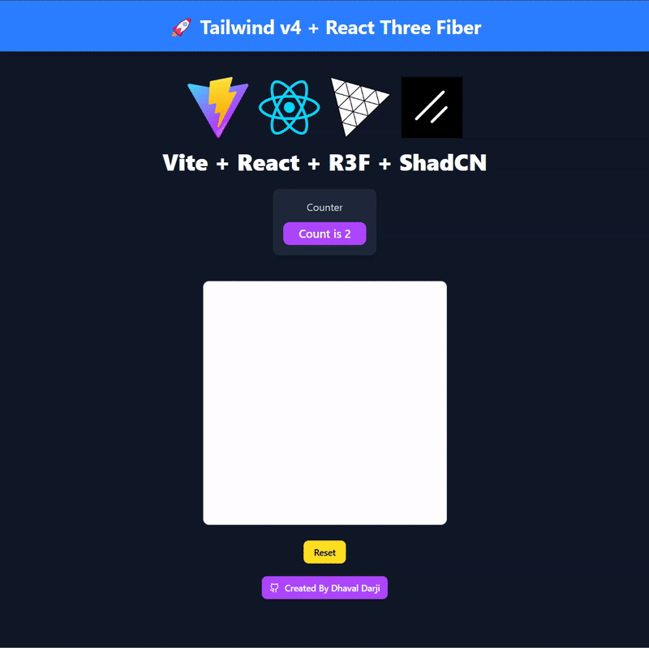

# 🚀 R3F Vite + Framer Motion + ShadCN

A modern, high-performance web application built with **React Three Fiber (R3F)**, **Vite**, **Framer Motion**, and **ShadCN**.

## 📌 Features

- ⚡ **Vite** - Fast and optimized development environment.
- 🎨 **React Three Fiber (R3F)** - Render and manage 3D scenes with ease.
- 🖼 **Framer Motion** - Smooth and fluid animations.
- 💎 **ShadCN** - Beautiful, accessible UI components.
- 🎨 **Tailwind CSS** - Modern utility-first styling.
- 🔥 **Hot Module Replacement (HMR)** - Instant updates without refreshing.
- 📦 **Optimized Performance** - Minimal and lightweight.

## 📁 Project Structure

```
/public
  ├── vite.svg
/src
  ├── assets
  │   ├── react.svg
  │   ├── shadcn-ui.jpg
  │   ├── threejs.png
  │   ├── vite.svg
  ├── components
  │   ├── ui
  │   │   ├── button.tsx
  ├── lib
  │   ├── utils.ts
  ├── App.css
  ├── App.tsx
  ├── index.css
  ├── main.tsx
/.gitignore
/components.json
/eslint.config.js
/index.html
/package-lock.json
/package.json
/postcss.config.js
/README.md
/tailwind.config.js
/tsconfig.json
/vite.config.js
```

## 🛠 Installation

Clone the repository:

```sh
git clone https://github.com/dsquare0601/r3f-vite-fm-shadcn.git
cd r3f-vite-fm-shadcn
```

Install dependencies:

```sh
npm install
```

## 🚀 Usage

Start the development server:

```sh
npm run dev
```

Build for production:

```sh
npm run build
```

## 🎨 Tech Stack

- **Vite** - Lightning-fast frontend tooling.
- **React Three Fiber (R3F)** - 3D rendering in React.
- **Framer Motion** - Animations and transitions.
- **ShadCN** - Modern, accessible UI components.
- **Tailwind CSS** - Utility-first styling.

## 📷 Preview



## 🤝 Contributing

Contributions are welcome! Feel free to open issues or pull requests.

## 📜 License

This project is open-source and available under the [MIT License](LICENSE).

---

🚀 **Created by [Dhaval Darji](https://github.com/dsquare0601)**
